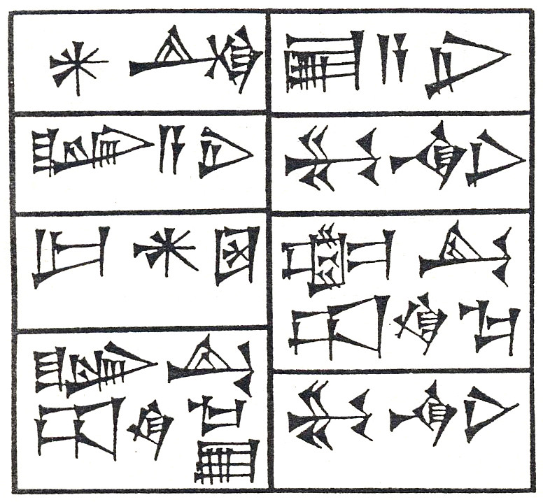

Welcome to An OWL Ontology of a Sumerian Grammar Project pages!
===============================================================

|Ur-Namma|

*The cuneiforn text of Ur-Namma tablet, III Millennium B.C.*

An OWL Ontology of a Sumerian Grammar is a research project performed in 2006 by Epistematica.

**Table of contents**

.. toctree::
   :maxdepth: 3

   project
   ontology
   paper

- `Project's repository on GitHub <https://github.com/Epistematica/sumerian-ontology>`__

|
|

.. |Licenza Creative Commons| image:: http://i.creativecommons.org/l/by-nc-nd/3.0/80x15.png
   :target: http://creativecommons.org/licenses/by-nc-nd/3.0/
.. |This material is Open Knowledge| image:: http://assets.okfn.org/images/ok_buttons/ok_80x15_red_green.png
   :target: http://opendefinition.org/
